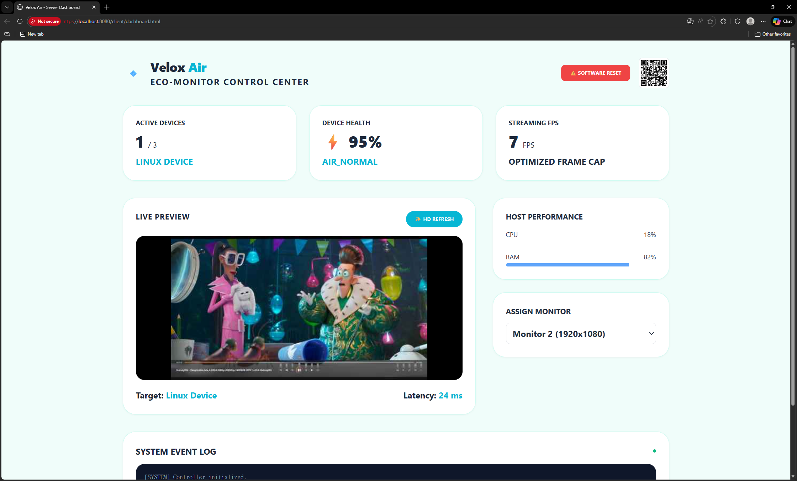
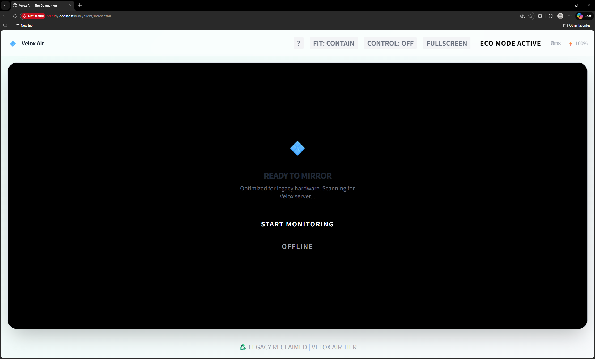
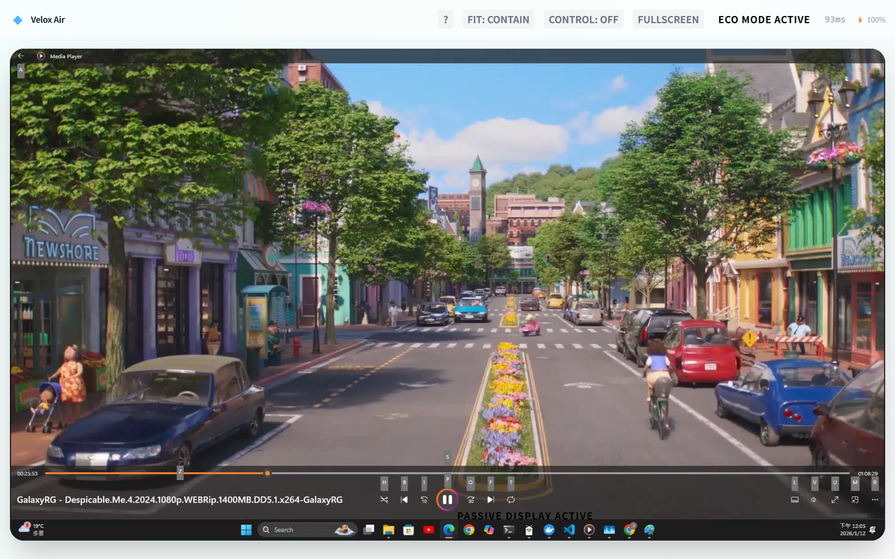

# 🟢 Velox Air - The Companion (v1.0)

**"Reclaiming legacy hardware through eco-friendly performance."**

Velox Air is the passive, web-based tier of the Velox Studio portfolio. It turns old tablets and phones into auxiliary information displays without requiring any app installation.

## ✨ Key Features
*   **Zero-Install**: Connect via any modern browser (Chrome, Safari, Edge).
*   **Eco-Mode (20 FPS)**: Hard-capped frame rate to prevent battery drain and overheating on older devices.
*   **App-Like Experience**: Support for "Add to Home Screen" (PWA) to run fullscreen without browser UI.
*   **Resilient Connectivity**:
    *   Auto-reconnects on Wi-Fi drops.
    *   Works even with "Strict" Browser Privacy/Tracking Prevention enabled.
    *   Automatic Port Seeker (8765 -> 8766 -> 8767) if the default port is busy.
*   **Cross-Platform**: Runs on Windows, Linux, and macOS.

## 📸 Preview
| Server Dashboard | Client Main Page | Fullscreen Mode |
| :---: | :---: | :---: |
|  |  |  |

## 🚀 Quick Start (Binaries)
1.  Download the latest release for your OS from the [Releases Page](../../releases).
2.  Run the executable:
    *   **Windows**: `VeloxAir_Server_Windows.exe`
    *   **Linux**: `./VeloxAir_Server_Linux` (Ensure you `chmod +x` it first)
    *   **macOS**: `./VeloxAir_Server_macOS` (You may need to allow it in Security settings)
3.  Ensure your PC and Tablet are on the **same Wi-Fi network**.
4.  On your Tablet:
    *   Scan the **QR Code** displayed on the Server Dashboard.
    *   Or open the URL shown in the console (e.g., `http://192.168.1.X:8765`).

## 🛠️ Build from Source

### Prerequisites
*   **Python 3.11+**
*   **Git**

### 1. Clone the Repository
```bash
git clone https://github.com/YourUsername/Velox-Air.git
cd Velox-Air
```

### 2. Install Dependencies
```bash
pip install -r requirements.txt
pip install pyinstaller
```

### 3. Build Executable
**Windows:**
Run the build script:
```cmd
build_air.bat
```
*Or manually:*
```bash
pyinstaller --clean velox_air.spec
```

**Linux / macOS:**
```bash
pyinstaller --clean velox_air.spec
```

The output binary will be located in the `dist/` directory.

### 4. Run from Source (Development)
If you prefer to run the python script directly without building:
```bash
python main.py
```

## 📱 Client Guide
### Fullscreen Mode
*   **Android (Chrome):** Tap menu (⋮) -> "Add to Home Screen". Open the new icon for a full app experience.
*   **iOS (Safari):** Tap Share button -> "Add to Home Screen".
*   **Manual:** Tap the "Fullscreen" button in the top navigation bar.

### Controls
*   **? (Help):** View operational rules and tips.
*   **Scaling:** Toggle between Contain (Fit), Cover (Fill), and Stretch.
*   **Control Toggle:** Enable/Disable touch input (Mouse simulation).

## 🔧 Architecture
*   **Backend:** Pure Python (AsyncIO + Aiohttp) with MSS/DXCAM (Windows) capture.
*   **Frontend:** Vanilla JS + Canvas 2D (No heavy frameworks).
*   **Protocol:** WebSocket (Binary Protocol v1.0).

---
*Built for PixelMirror Studio | 2026*
